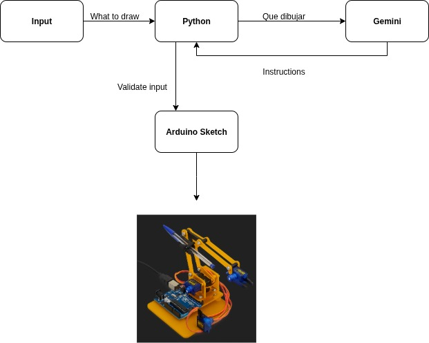

# 🤖 AI Drawing Arm

AI-powered robotic arm that interprets natural language prompts and draws symbolic figures on a 14×10 grid whiteboard using OpenAI.

---

## 📝 Project Description

**AI Drawing Arm** is a robotic system that takes natural language prompts (like "draw a frog") and autonomously creates symbolic drawings on a 14×10 grid (7×5 cm) whiteboard.  
The pipeline uses **OpenAI's GPT** model to convert user prompts into vector-based instructions, then applies **inverse kinematics** to control a dual-arm mechanical structure with two servo motors.

This project combines **natural language processing**, **motion planning**, and **hardware control** to simulate intelligent robotic drawing.

---

## 🧩 How It Works

1. **Input:**  
   The user writes a prompt (e.g., "draw a square").

2. **AI Translation:**  
   OpenAI returns a list of vector drawing instructions, e.g.:
   ```
   0 2 3
   1 4 0
   1 0 4
   1 -4 0
   ```
   - Each line: `<draw_flag> <delta_x> <delta_y>`
   - The pen starts at (0, 0) (bottom-left of the grid).

3. **Validation:**  
   Instructions are checked to ensure they stay within the 14×10 grid and are well-formed.

4. **Kinematics:**  
   Each grid position is converted to `(x, y)` in cm and mapped to servo angles using inverse kinematics.

5. **Output:**  
   A set of angles and pen commands is generated to control the robot arm.

---

## 🔧 Hardware Setup

The system simulates or controls a 2-arm robotic mechanism, each with 2 degrees of freedom:

| Arm       | Segment 1 (Upper) | Segment 2 (Lower) | Servo Mount Location |
|-----------|-------------------|-------------------|---------------------|
| Left Arm  | 6.0 cm            | 6.0 cm            | (5.0 cm, 5.0 cm)    |
| Right Arm | 6.0 cm            | 6.0 cm            | (10.0 cm, 5.0 cm)   |

- Each arm consists of two servos (total 4 servos).
- The tip of both arms converges on a shared pen mechanism.
- A microcontroller (e.g., Arduino or ESP32) actuates the motors based on calculated angles.

---

## 🛠️ Software Stack

- **Python:** Core logic (prompting, validation, kinematics)
- **OpenAI API:** Natural language processing
- **NumPy:** Vector math for servo angle calculation
- **Tkinter:** GUI for input and drawing preview (optional)
- **Serial (optional):** Send data to Arduino

---

## Features

- Converts natural language into drawing commands
- Validates instructions to ensure safe, in-bounds operation
- Inverse kinematics for dual-arm control
- Controls a 4DOF robotic arm with Arduino or ESP32
- Optional GUI for live drawing preview
- Modular codebase (AI, logic, and hardware separate)

---

## Applications

- AI-assisted drawing or sketching
- Educational demos for robotics and kinematics
- Natural language–controlled robots

---

## 📁 Project Structure

```text
ai-arm-drawing/
│
├── arduino/
│   └── robotic_hand.ino          # Arduino code for servo control
│
├── design/
│   └── arm.png                   # Robot arm illustration (used in GUI)
│
├── python/
│   ├── ai_arm_drawing.py         # GUI version (Tkinter)
│   ├── ai_client.py              # OpenAI client interface
│   ├── main.py                   # Terminal version
│   ├── servo_math.py             # Inverse kinematics calculations
│   ├── requirements.txt          # Python dependencies
│
├── .env                          # Contains API key (not committed)
├── .gitignore                    # Git ignore rules
├── LICENSE                       # MIT license
└── README.md                     # Project documentation
```

---

## 🚀 Getting Started

### 1. Hardware Requirements
- Arduino UNO or ESP32
- 4 servos (e.g., MG90S)
- Breadboard + power supply
- Optional: Joystick module for manual mode

### 2. Software Requirements
- Python 3.9+
- Arduino IDE
- OpenAI API key

### 3. Install Python Dependencies
```bash
pip install -r python/requirements.txt
```

### 4. Set your OpenAI API key
```bash
export OPENAI_API_KEY="sk-..."     # Linux / Mac
set OPENAI_API_KEY="sk-..."        # Windows
```
Or store it in a `.env` file:
```
OPENAI_API_KEY=sk-...
```

### 5. Upload Arduino Code
Open `arduino/robotic_hand.ino` in the Arduino IDE, choose your board and port, and upload.

### 6. Run Python Interface
```bash
python python/main.py              # Terminal version
python python/ai_arm_drawing.py    # GUI version
```

---

## 📐 High-Level Architecture



```text
User Prompt
    │
    ▼
OpenAI GPT (gpt-3.5 or gpt-4)
    │
    ▼
Drawing Instructions (vector format)
    │
    ▼
Validation & Kinematics (Python)
    │
    ▼
Servo Angles & Pen Commands
    │
    ▼
Robotic Arm (Arduino/ESP32)
```

---

## 📄 License

This project is licensed under the MIT License — see the LICENSE file.