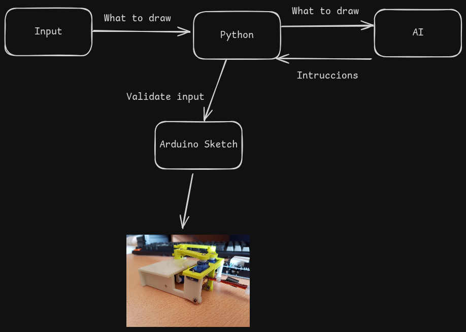

# 🤖 AI Drawing Arm

An AI-powered robotic arm that interprets natural language prompts and draws symbolic figures on a 14×10 grid using OpenAI and inverse kinematics.

---

## 📝 Overview

**AI Drawing Arm** is a Python-based project that takes natural language input (e.g., "draw a frog") and converts it into physical motion via a robotic arm. It uses OpenAI's GPT models to interpret user intent, generates vector instructions for drawing, validates and centers the design, and transforms it into servo angles using a dual-arm inverse kinematics system.

The robot then physically draws the output on a **14×10 grid** (7×5 cm) whiteboard using two servo-controlled arms and a shared pen.

---

## 🧠 How It Works

1. **Prompt Input**  
   The user types a drawing command (e.g., "draw a house").

2. **AI Instruction Generation**  
   The GPT model returns a list of drawing instructions in the format:
   ```text
   <draw_flag> <x> <y>
   ```
   - `draw_flag`: 1 = draw, 0 = move
   - `x, y`: absolute grid positions (0–13, 0–9)

3. **Validation & Refinement**
   - Ensures the figure fits the 14×10 grid.
   - Auto-closes open shapes for visual coherence.
   - Rescales to robot's coordinate space.

4. **Kinematic Translation**
   Each (x, y) grid point is mapped to (cm) and then to (θ1, θ2) servo angles using brute-force inverse kinematics.

5. **Execution**
   The angles and pen commands are visualized and optionally sent to an Arduino or ESP32 to control a 4DOF robotic arm.

---

## 🔧 Hardware Overview

| Arm       | Segment 1 (L1) | Segment 2 (L2) | Base Position      |
|-----------|----------------|----------------|--------------------|
| Left Arm  | 4.0 cm         | 5.0 cm         | (-1.3 cm, 0 cm)    |
| Right Arm | 4.0 cm         | 5.0 cm         | (+1.3 cm, 0 cm)    |

- Each arm uses 2 servo motors (4 total).
- The arms are symmetric and converge to control a shared pen tip.
- Controlled by Arduino or ESP32 via serial commands.

---

## 🧰 Software Stack

- **Python 3.9+**
- **OpenAI API** – natural language → instructions
- **NumPy** – kinematics
- **Matplotlib** – live drawing preview
- **PySerial** – communication with Arduino

---

## ✅ Features

- Natural language prompt → symbolic drawing
- OpenAI-based refinement and validation
- Automatic shape closure and centering
- Brute-force inverse kinematics solver
- Servo angle generation for dual-arm setup
- Serial interface to Arduino or ESP32
- Optional live visualization

---

## 🎯 Use Cases

- Natural language–driven robotic drawing
- Educational tool for robotics and geometry
- Experimental platform for prompt-to-motion interfaces

---

## 📐 High-Level Architecture



---

## 📁 Project Structure

```text
ai-arm-drawing/
│
├── arduino/
│   └── robotic_hand.ino         # Arduino servo control code
│
├── design/
│   └── arm.png                  # Arm diagram or high-level illustrations
│
├── python/
│   ├── main.py                  # CLI interface to drawing system
│   ├── ai_client.py             # GPT interaction logic
│   ├── servo_math.py            # Inverse/direct kinematics
│   ├── serial_sender.py         # Serial port communication
│   ├── plot_drawing.py          # Grid-based drawing preview
│   ├── plot_movement.py         # Real-time servo movement visualization
│   ├── prompt_engineer.py       # GPT prompt builders
│   ├── validation.py            # Input validation logic
│   ├── rescale.py               # Grid translation utilities
│   ├── instruction_handler.py   # Prompt → validated points
│   ├── config.py                # Centralized constants
│   └── requirements.txt         # Dependencies
│
├── run.sh                       # Bash script to activate env & run
├── .env                         # API keys (not tracked)
├── LICENSE
└── README.md
```

---

## 🚀 Getting Started

### 🔌 Hardware Required
- Arduino UNO or ESP32
- 4x Servo motors (e.g., SG90 or MG90S)
- Breadboard + 5V power supply
- (Optional) Pen lift mechanism (servo or magnet)

### 💻 Software Requirements
- Python 3.9+
- Arduino IDE
- OpenAI API key

### 📦 Install Dependencies
```bash
cd python/
pip install -r requirements.txt
```

### 🔑 Set Your OpenAI Key
```bash
export OPENAI_API_KEY="sk-..."   # Unix/macOS
set OPENAI_API_KEY="sk-..."      # Windows
```
Or use a `.env` file:
```env
OPENAI_API_KEY=sk-...
```

### ⬆️ Upload Arduino Code
1. Open `arduino/robotic_hand.ino` in Arduino IDE
2. Select board and port
3. Upload to your device

### ▶️ Run the Drawing Interface
```bash
# Option 1: Run directly
python python/main.py

# Option 2: Use the helper script
./run.sh
```

---

## 🧠 System Flow

```text
[ User Prompt ]
      ↓
[ GPT Instruction Generation ]
      ↓
[ Validation + Auto-Correction ]
      ↓
[ Rescaling + Centering ]
      ↓
[ Inverse Kinematics (Brute Force) ]
      ↓
[ Visualization / Serial Transmission ]
      ↓
[ Dual Arm Robot Draws on Grid ]
```

---

## 📜 License

This project is released under the MIT License. See LICENSE for details.